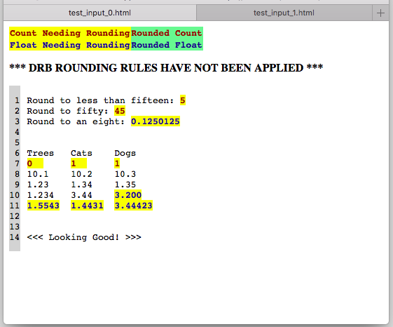
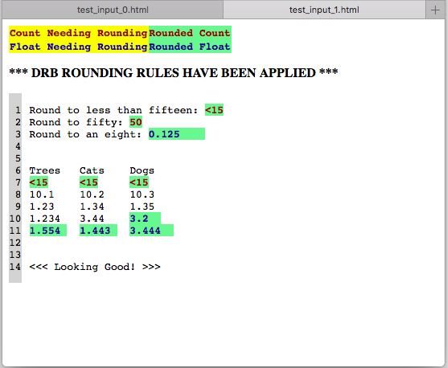
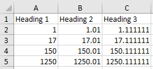
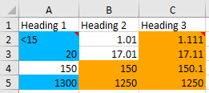

# Using the DRB Rounder 
The DRB Rounder is a python3 program that implements the rounding rules for the
U.S. Census Bureau's Disclosure Review Board. These rules provide some
protection against disclosure of information tracable to individuals, but do not
provide privacy protection that is formally provable. The rounding rules are an
interim solution for privacy protection, but the plan is to replace them with a
system that is formally private at some point in the future.

The DRB Rounder currently implements the following features:
* Identifies numbers with no decimal point as integers, and numbers that have a
decimal point as floating point numbers.
* Applies the DRB rules for counts to integers. Specifically:
  * If N is less than 15, report N<15
  * If N is between 15 and 99, round to the nearest 10
  * If N is between 100-999, round to the nearest 50
  * If N is between 1000-9999, round to the nearest 100
  * If N is between 10000-99999, round to the nearest 500
  * If N is between 100000-999999, round to the nearest 1,000
  * If N is 1000000 or more, round to four significant digits
* Applies the "round to four decimal places" rule to floating point numbers.
  * Implements the IEEE floating point rounding rules with the "round half even"
option when rounding. This means that 1000.5 rounds to 1000 while 1001.5 rounds
to 1002.


## Acceptable Inputs
* Free Text Input [.txt, .log, .sas, .lst, .tex, .py, .r]
* Comma / Tab Separated Values [.csv, .tsv]
* Spreadsheets [.xlsx, .xls, .ods]
* Documents [.docx, .odt]


## Running the DRB Rounder on Free Text Input
To use the rounder, run the following from the Unix or Windows command line.
Note that `python3` must be in your path:

```sh
python3 drb_rounder.py filename.log
```

Where `filename.log` is the name of the text file containing numbers to be
rounded.

This will produce three output files:
  * `filename_rounded.log` --- The file with the rounded data
  * `filename_0.html` --- An HTML file showing the original data, with
  annotations on the values that require rounding.
  * `filename_1.html`--- An HTML file showing the rounded data, with
  annotations to indicate what was rounded.

If you open both of the HTML files in different tabs of a web browser, you can
easily toggle between the two views:

 


## Running the DRB Rounder on a CSV file
Similar to how it's run on free text input, we can run the following from the
Unix or Windows command line:

```sh
python3 drb_rounder.py filename.csv
```

If your CSV file is a tab-separated file, be sure to use the --tab flag as
seen below:

```sh
python3 drb_rounder.py filename.csv --tab
```

This will generate an output file: filename_rounded.csv


## Running the DRB Rounder on an Excel Spreadsheet
To use the rounder, run the following from the Unix or Windows command line.
NOTE the following:
  * `python3` must be in your path:
  * all .xls and .ods files will be converted to .xlsx if you're running this
  on a windows machine
  * if a cell has alphabetical symbols in it, rounding will not be applied to
  that cell (i.e. Year: 2018)
  * if a cell has any non-digit symbols between digit values, rounding will not
  be applied to that cell (i.e. 06/27/2018)
  * rounding rules are applied to the actual value of the cell, and not the 
  value that is solely displayed by excel formatting

```sh
python3 drb_rounder.py filename.xlsx
```
If you don't want the rounder to actually round the improperly rounded cells and
only highlight these cells, pass the highlight flag as shown below.

```sh
python3 drb_rounder.py filename.xlsx --highlight
```

These commands will generate a new spreadsheet `filename_rounded.xlsx` which
will contain all of the rounded values.
  * All blue colored cells represent an integer that was rounded
  * All orange colored cells represent a float that was rounded

 


## Running the DRB Rounder without an installation of Python
We've packaged all of the source code and its dependencies so that you don't
need an installation of python to run the rounder. NOTE: the executable is
located in CED's shared drive under M:\Users\Thomas

To run the executable, simply enter the following from the project's root 
directory:

```sh
./drb-rounder-executable/dist/drb_rounder/drb_rounder.exe <test_filename_here>
```

or if you're using command prompt on windows, run

```sh
\drb-rounder-executable\dist\drb_rounder\drb_rounder.exe <test_filename_here>
```


## Reports Generated
2 log files will be generated in your current working directory (wherever you
are running the executable or python script).
  * `rounder.log` is an application log which is a growing file describing
  successful runs as well as unsuccessful runs and their errors
  * `rounded_values.log` is a log file which reports what values have been
  rounded and the values they were rounded to on the previous run of the rounder


## Creating the Executable for Yourself!
I used the pyinstaller python package to bundle the source code along with its
dependencies to be run as an executable. If you don't currently have the package,
you can install it through [anaconda](https://anaconda.org/conda-forge/pyinstaller)

Once you have pyinstaller downloaded, simply run the pyinstaller command and
pass in your project's driver program.

```sh
pyinstaller drb_rounder.py
```

The executable can be found at `dist/drb_rounder/drb_rounder.exe`


# Detached head
Use this:

```sh
$ git checkout -b tmp  ; git checkout master ; git merge tmp ; git branch -d tmp 
```

